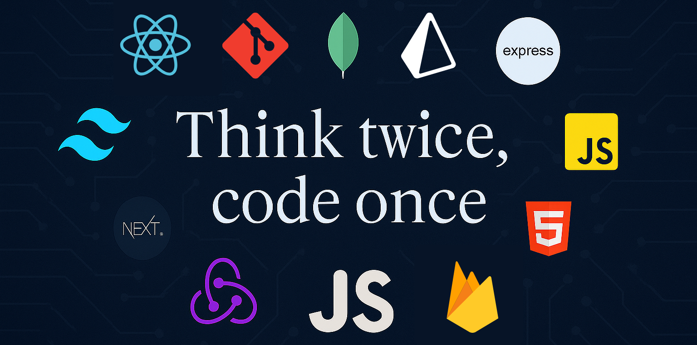

<meta name="google-site-verification" content="QluewUBiBuvg1hQW3YmI7vj3zRVALFJqw-OM5ykQb-U" />

<!-- Ha ha banner section -->

  

 

# Hi there! I'm Rakib Hasan Sohag
<!--  a brief introduction about My Self -->
I am a passionate MERN stack developer with a love for building web applications. I specialize in developing scalable and efficient solutions using MongoDB, Express.js, React.js, and Node.js. I enjoy working on both the front-end and back-end, creating seamless user experiences.

<!-- Stats -->

<table>
  <tr>
    <td width="60%" valign="top">
      
    </td>
    <td width="40%" height="100%" valign="top">
      
    </td>
  </tr>
</table>

<!--  badges representing your skills, social media profiles, or any other relevant information -->

  
  
  
  
  
  
  
   
  
  
  

<!--  key skills and technologies -->
## Skills
💻 Front-end: JavaScript, React.js, Next.js, SCSS, Bootstrap, Tailwind  
🔧 Back-end: NodeJS, ExpressJS 
🛢 Database: MongoDB, Firebase, Supabase    
☑️ Version Control: Git   
🎨 Design Tools: Photoshop, Figma  
🌐 Technologies: Postman, Vs-Code editor, Notion, Slack, MongoDB Compass, Chrome Dev Tool , redux Dev Tool , react-Query Dev Tool  

<!--  MERN stack projects or highlight your notable projects -->
## Projects
- [50 days Challenge ](https://github.com/rakibhasansohag/50-day-challange--html-Scss-js-): 50 mini-projects tackling HTML, SCSS & vanilla JS skills.
- [React DashBoard](https://github.com/rakibhasansohag/React-Dashboard): A fully responsive admin panel with dynamic charts.

<!-- interests, hobbies, or other fun facts -->
## Interests
- Exploring new libraries and frameworks in the MERN stack.
- Solving coding challenges and participating in various short projects.
- Contributing to open-source projects related to the MERN stack.

<!--   call to action or any other concluding statement -->
Feel free to explore my repositories and connect with me. I'm always open to collaboration and eager to work on exciting MERN stack projects. Let's build amazing web applications together!

<!--  footer or any other closing statement -->
 don't be shy Stranger! ⭐️ Star the repositories if you like to show your support!
