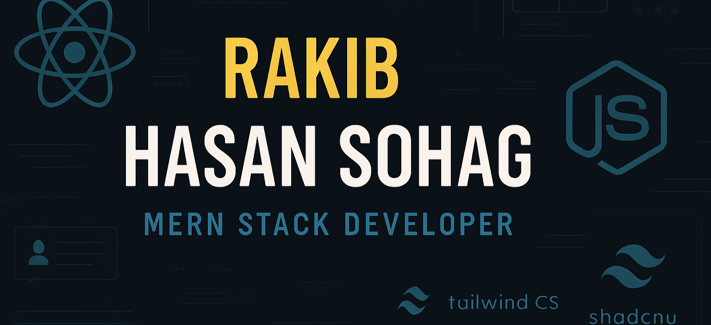

<meta name="google-site-verification" content="QluewUBiBuvg1hQW3YmI7vj3zRVALFJqw-OM5ykQb-U" />

  

# Hi there! I'm Rakib Hasan Sohag
#### MERN Stack Developer | Full Stack Enthusiast

<!--  a brief introduction about My Self -->
I am a passionate MERN stack developer with a love for building web applications. I specialize in developing scalable and efficient solutions using MongoDB, Express.js, React.js, and Node.js. I enjoy working on both the front-end and back-end, creating seamless user experiences.

<table>
  <tr>
    <td width="60%" valign="top">
      
    </td>
    <td width="40%" height="100%" valign="top">
      
    </td>
  </tr>
</table>

<!--  badges representing your skills, social media profiles, or any other relevant information -->

<!--  key skills and technologies -->
## Skills
💻 Front-end: HTML, CSS, JavaScript, React.js, Next.js, SCSS, Bootstrap, Tailwind  
🔧 Back-end: NodeJS, ExpressJS 
🛢 Database: MongoDB, Firebase, Supabase    
☑️ Version Control: Git   
🎨 Design Tools: Photoshop, Figma  
🌐 Technologies: Postman, Vs-Code editor, Notion, Slack, MongoDB Compass, Chrome Dev Tool , redux Dev Tool , react-Query Dev Tool  

<!--  MERN stack projects or highlight your notable projects -->
## Projects
- [50 days Challenge ](https://github.com/rakibhasansohag/50-day-challange--html-Scss-js-): it's an 50 days challenge on html scss and js .
- [React DashBoard](https://github.com/rakibhasansohag/React-Dashboard): this project is made by react and fully responsive.
- [Team Management ](https://github.com/rakibhasansohag/React-Projects/tree/main/team-manage): it's an react project based on task and team member management.
- [Web design projects](https://github.com/rakibhasansohag/Web-Design-Projects):  This repository showcases a collection of my web design projects, demonstrating my skills and creativity in web development. Each project presents unique challenges and solutions, highlighting my ability to design visually appealing and functional websites.

<!-- interests, hobbies, or other fun facts -->
## Interests
- Exploring new libraries and frameworks in the MERN stack.
- Solving coding challenges and participating in various short projects.
- Contributing to open-source projects related to the MERN stack.

<!--   call to action or any other concluding statement -->
Feel free to explore my repositories and connect with me. I'm always open to collaboration and eager to work on exciting MERN stack projects. Let's build amazing web applications together!

<!--  footer or any other closing statement -->
 don't be shy Stranger! ⭐️ Star the repositories if you like to show your support!
